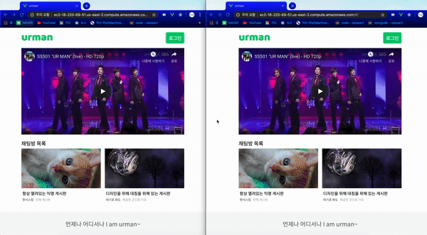

# 유어맨 - 익명 채팅 서비스
## 언제나 어디서나 I am urman~

## [서비스 링크](https://bit.ly/2KgZcWk)




## 1. packe.json에 작성된 라이브러리 설치
```
npm install
```

## 2. 개발 모드로 실행
```
npm run serve
```

이렇게 하면 api 서버 따로 실행해줘야 해요 server.js 이거 주석처리하고 지운다음 node server.js
```
app.use(express.static(__dirname + "/dist/"));
app.get(/.*/, (req, res) => {
    res.sendfile(__dirname + "/dist/index.html")
})
app.listen(80);
```

## 3. 배포용으로 프로젝트 빌드
```
npm run build
```

## 4. 배포용 프로젝트 실행
```
npm start
```